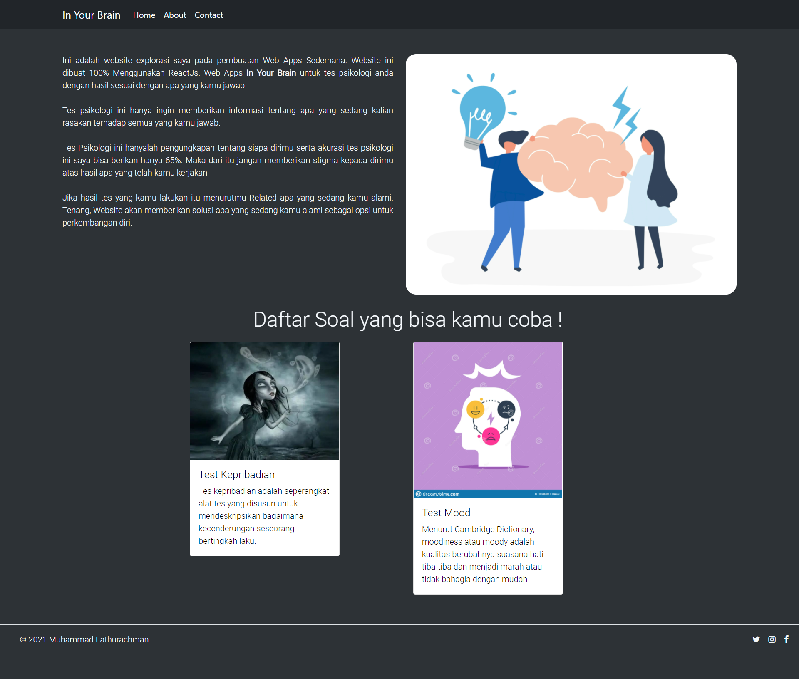

<h1 align="center" style="border-bottom: none !important; margin-bottom: 5px !important;">In Your Brain</h1>

In your Brain adalah aplikasi test psikologi dengan test pilihan ganda yang dapat menghasilkan hasil yang related apa yang sedang kamu rasakan saat ini. Divalidasi dari skor dan bisa memberikan hasil serta solusi apa yang tengah kamu alami 

 

> ✨ **Note:** Kamu bisa Download Secara Gratis dan dapat dikembangkan sendiri

 

### Cara install

- Silahkan Clone atau download file ZIP
- Install dependencies dengan menggunakan `yarn` or `npm install`
- install juga <a href="https://github.com/typicode/json-server">`JSON-SERVER`</a> `npm install -g json-server` untuk consume mockup API
- Jalankan `yarn start` atau `npm run start`.
- jalankan `json-server --watch dbTest.json --port 4000` untuk localhost atau jalankan `json-server --host 192.168.1.3 dbTest.json --port 4000` untuk share ke client. file `dbTest.json` ada di direktori `COREAPI/dbTest.json`
- atur Base-URL di `src/API/BaseUrl` samakan dengan Base url
- 😎 **Selamat !** Program bisa dijalankan

 

### Fitur

- Bisa Memilih Test psikologi yang tersedia
- Penjelasan tentang soal psikologi yang dipilih
- mengerjakan soal psikologi yang dipilih
- bisa mengetahui hasil test dan diberikan solusi apa yang sedang kamu alami
